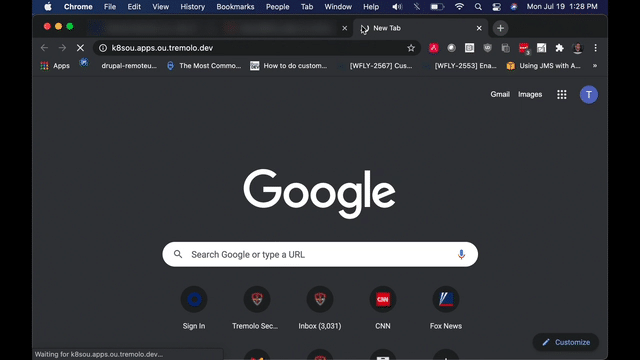
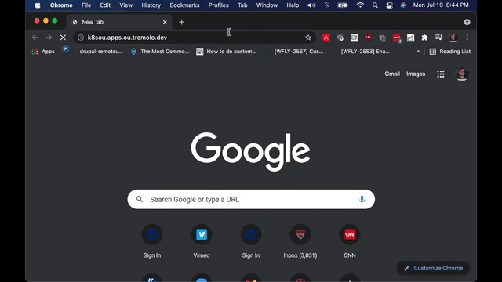
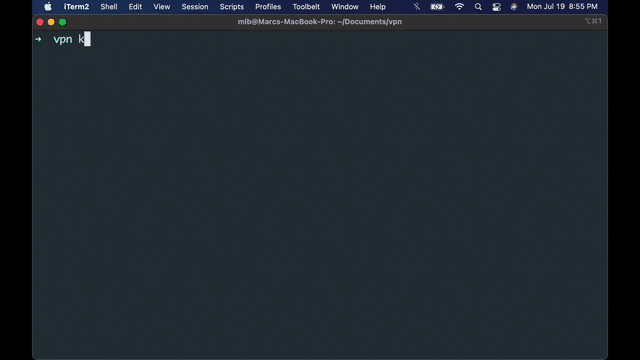

# Access Portal for Kubernetes

OpenUnison is the an access portal for your Kubernetes deployments.  You can use it manage access to a single cluster or for
all of your clusters.  Using OpenUnison you your Active Directory groups, or Okta groups, in your RBAC bindings.  With OpenUnison:

##Secure Access To the Dashboard

Orchestra provides secure access to your dashboard without creating service accounts.  Your identity is used by the dashboard
to interact with the API server, which means the dashboard runs without privileges of its own.

##kubectl SSO For Windows, Linux, and MacOS

The Orchestra portal provides kubectl commands for all of your user's operating systems.  Windows, Linux, and MacOS commands are all
generated.  The commands include certificates for your API server and Orchestra portal, so there are no certificates to distribute!

##kubectl Plugin

